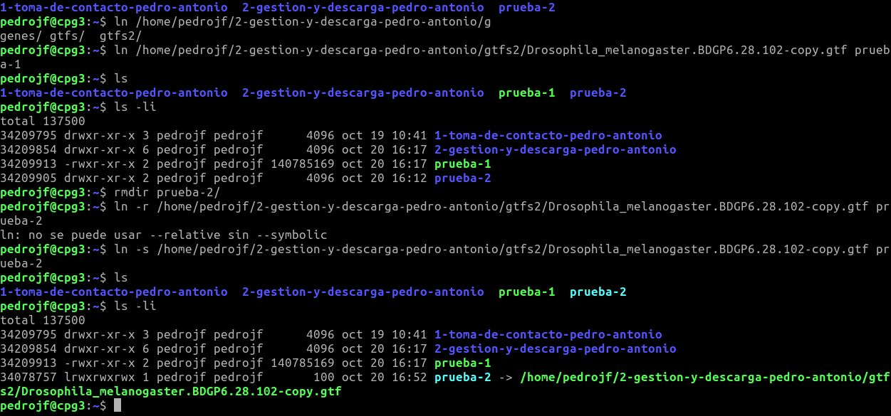
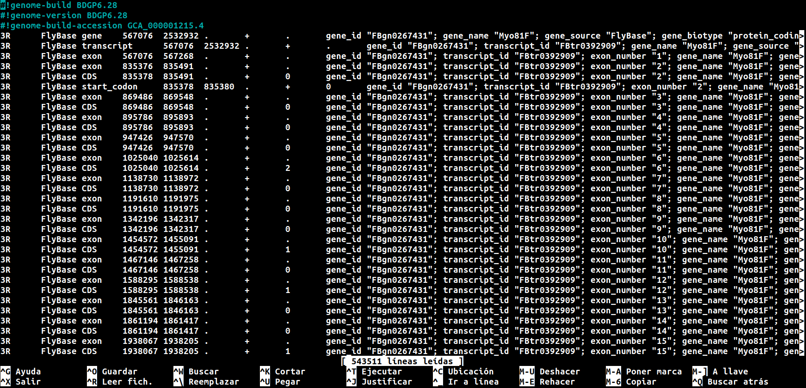
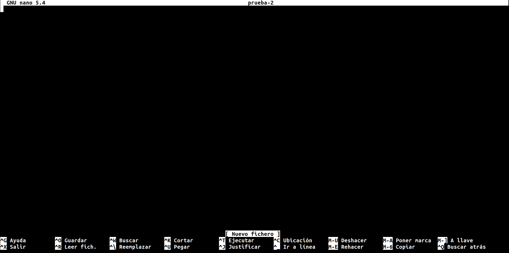
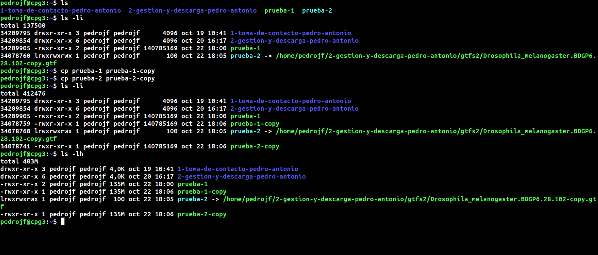

# Sesión II - Gestión avanzada y descarga de datos
Herramientas computacionales para bioinformática: UNIX, expresiones regulares y shell script

Edita esta plantilla en formato markdown [Guía aquí](https://guides.github.com/features/mastering-markdown/) como se pide en el guión. 
Cuando hayas acabado, haz un commit de tus cambios y súbelos al repositorio antes de la fecha de entrega señalada. 
Puedes usar el cliente 

======================================
Antes de comenzar, crea

## Ejercicio 1
Crea una copia de la carpeta gtfs. Luego crea enlaces duros y blandos a los ficheros .gtf y responde:

1. ¿Qué ocurre cuando se borra el origen y se intenta acceder al destino?
2. ¿Qué ocurre cuando se borra el destino y se intenta acceder al origen?
3. ¿Qué ocurre con la otra parte cuando se edita el destino o el origen del enlace?
4. ¿Qué ocurre cuando copiamos un enlace?

### Respuesta ejercicio 1

Hemos copiado la carpeta gtfs a otra que se llama gtfs2 después, hemos realizado una copia del archivo `Drosophila_melanogaster.BDGP6.28.102.gtf` y hemos llamado a la copia `Drosophila_melanogaster.BDGP6.28.102-copy.gtf` para ello hemos empleado el comando `cp 2-gestion-y-descarga-pedro-antonio/gtfs/Drosophila_melanogaster.BDGP6.28.102-copy.gtf 2-gestion-y-descarga-pedro-antonio/gtfs2`. Después hemos creado un enlace duro y uno blando al archivo `Drosophila_melanogaster.BDGP6.28.102-copy.gtf`, para crear el enlace duro se ha empleado el comando `ln /home/pedrojf/2-gestion-y-descarga-pedro-antonio/gtfs2/Drosophila_melanogaster.BDGP6.28.102-copy.gtf prueba-1`, mientras que para el blando el comando `ln -s /home/pedrojf/2-gestion-y-descarga-pedro-antonio/gtfs2/Drosophila_melanogaster.BDGP6.28.102-copy.gtf prueba-2`. Al enlace duro lo hemos denominado prueba-1 y al blando prueba-2. 

1. ¿Qué ocurre cuando se borra el origen y se intenta acceder al destino?

Comandos introducidos:

`rm 2-gestion-y-descarga-pedro-antonio/gtfs2/Drosophila_melanogaster.BDGP6.28.102-copy.gtf`

Cuando se borra el origen (es decir el archivo original al cúal van enlazados los enlaces), de un enlace duro, se puede seguir accediendo al archivo original.

Sin embargo con los enlaces blandos al intentar abrir el archivo con el comando nano para editarlo, este aparece en blanco, lo que quiere decir que no se puede acceder al archivo original.

2. ¿Qué ocurre cuando se borra el destino y se intenta acceder al origen?

Cuando se borra el destino (entendiendo por destino el enlace), de un enlace duro, es decir, se borra el enlace duro, este deja de existir y por lo tanto ya no se puede emplear, sin embargo el archivo orginal al cual estaba enlazado (el origen) permanece intacto.

Comandos introducidos:

`rm prueba-1`

Cuando se borra el destino (entendiendo por destino el enlace), de un enlace blando, es decir, se borra el enlace blando, este deja de existir y por lo tanto ya no se puede emplear, sin embargo el archivo orginal al cual estaba enlazado (el origen) permanece intacto.

Comandos introducidos:

`rm prueba-2`

3. ¿Qué ocurre con la otra parte cuando se edita el destino o el origen del enlace?

En el enlace duro cuando se edita con el comando `nano` el destino (enlace) los cambios no aparecen en el orígen (archivo original), y si se edita el origen los cambios tampoco aparecen en el destino (enlace).

Sin embargo en el enlace blando si que aparece la edición que hemos realizado en el origen (archivo original). Además si se edita el enlace, los cambios también aparecen en el orígen (archivo original).

4. ¿Qué ocurre cuando copiamos un enlace?

Comandos introducidos:

`cp prueba-1 prueba-1-copy`\
`cp prueba-2 prueba-2-copy`

Tal y como se aprecia en la imágen, al copiar el enlace duro se ha generado otro enlace duro que apunta a un inodo diferente, mientras que al copiar el enlace blando se ha creado un enlace duro que apunta de nuevo a un inodo distinto al de los otros enlaces.

## Ejercicio 2
Usa la documentación de `find` para encontrar todos los notebook Jupyter con fecha de última modificación 30 de Noviembre de 2020 que haya en tu directorio HOME. Excluye todos aquellos que se encuentren dentro de directorios ocultos (aquellos que comienzan por un punto `.`). 

### Respuesta ejercicio 2
Para la fecha de última modificación, emplenado el comando `man find`buscamos información sobre los distintos comandos distintos que podemos emplear junto a find. Y encontramos que para la fecha de última modificación emplearemos el comando: .....................

## Ejercicio 3
Descarga, empleando la orden oportuna, todos los ficheros [de esta URL](ftp://ftp.ensembl.org/pub/release-102/gtf/accipiter_nisus/). 
- Inspecciona el fichero CHECKSUMS y genera los checksums adecuados para asegurarte de que los datos son íntegros. 
- Genera un fichero SHA-1 para todos los ficheros .gz descargados y documenta en esta memoria el comando con el que te descargaste los datos, adjuntando aquí los checksums. 

### Respuesta ejercicio 3
Aplicamos el comando:
`wget --accept "*.gtf" --no-directories --recursive --no-parent ftp://ftp.ensembl.org/pub/release-102/gtf/accipiter_nisus/`

Pero no funcionó, miramos con el comando `wget --help` pero no encontramos solución a este problema, por lo que empleamos el comando: 
`curl ftp://ftp.ensembl.org/pub/release-102/gtf/accipiter_nisus/`

Con este comando podemos ver el fichero CHECKSUMS, pero no lo tenemos copiado en nuestro repositorio para inspeccionarlo. 
